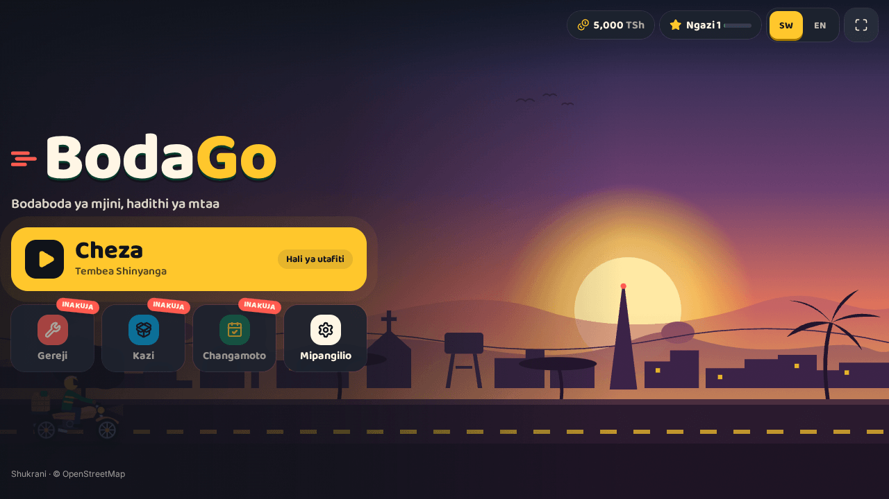
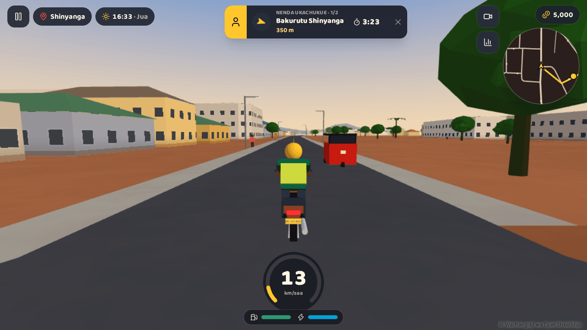
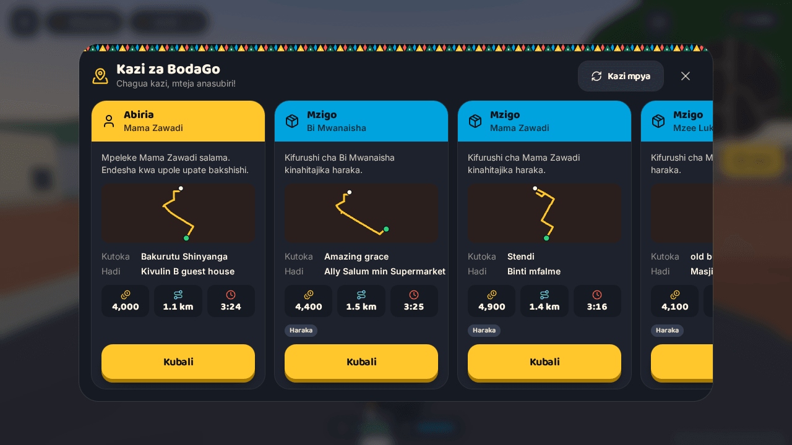

# BodaGo 🏍️

A PWA-first 3D bodaboda delivery game set in **real Tanzanian cities generated from OpenStreetMap**.
Swahili-first (English toggle), landscape-first, built for budget Android phones.

Ride a boda through Shinyanga, Arusha, Mwanza and Kariakoo. Pick up passengers and parcels, dodge daladalas,
show your leseni at police checkpoints, earn TZS and work your way from a rented Mkopo Ride to the gold-trimmed Legend Boda.

| Main menu | Riding in Shinyanga | Mission board |
|---|---|---|
|  |  |  |

## Run it

```bash
npm install
npm run dev                  # http://localhost:3000 (service worker off in dev)
npm run build && npm start   # production build with the PWA service worker
```

| Command | What it does |
|---|---|
| `npm run bake -- <city>` | Rebuild `public/cities/<city>/` from cached OSM data (`shinyanga`, `dodoma`, `moshi`, `arusha`, `tanga`, `mwanza`, `mbeya`, `kariakoo`) |
| `npm run bake -- <city> --refresh` | Re-download from Overpass first (falls back to the OSM API, split into tiles for dense towns) |
| `npm run icons` | Regenerate favicon and PWA icons |
| `npm run typecheck` / `npm run lint` | Strict TypeScript / ESLint |

All four cities are baked and committed (2.8 MB of JSON), so no bake is needed to play.
Behind an HTTP proxy, bake with `NODE_USE_ENV_PROXY=1` (Node ≥ 22.21).

**Controls:** `W/↑` throttle · `S/↓/Space` brake · `A/D` steer · `Shift` boost · `Q` wheelie · `H` horn · `C` camera · `E` show licence · `Esc` pause.
On phones: steering pad on the left (or tilt), throttle and brake pedals plus horn, boost and wheelie on the right.
A left-handed layout and auto-throttle are in Settings. Gamepads work (standard mapping).

## What's in the game

- **Bike:** arcade physics with lean, drift on dirt, wheelies, boost, fuel and damage. Surfaces include tarmac, dirt, footpath, off-road and mud in the rain. You slide along walls, and only hard hits cause a short stumble. There's a chase camera (speed FOV, look-ahead, pulls in near walls) and a rider-eye view.
- **City life:**
  - Traffic (cars, daladalas, bajaji, trucks, bodas) drives on the left with car-following and junction right-of-way. Vehicles honk, and daladalas pull over for passengers.
  - Pedestrians cross the road, with crowds thicker around markets.
  - At police checkpoints you meet Afande Salum.
  - Lamps, kiosks, umbrella vendors and billboards line the streets.
- **Time and weather:** a full day cycle with stars, lit windows and lamp light pools at night, and a headlight. Rain brings wet roads, puddles and grip loss; dusty haze comes and goes.
- **Real places on the map:** every hospital, clinic, pharmacy, school, market, petrol station, bank, office, shop, mechanic and bus stop mapped in OpenStreetMap gets a roadside signpost with its own badge. The nearest ones show their real names, and they also appear on the minimap. Bus stops and stands get shelters with people waiting; main roads without a mapped stop get daladala stops every ~300 m.
- **Thirteen mission types**, built from real OSM places:
  - Abiria, Mzigo, Dharura
  - Chai ya Asubuhi (spill meter), Soko Run, Shule Run
  - Wageni (photo stops at landmarks)
  - Mbio (fixed race courses with ghosts of your best run)
  - Chipsi Mayai Rush (chained combo), Night shift
  - **Ninunulie:** the customer sends money to your phone, you buy their list at a real market stall, shop or pharmacy (haggle at the market), and bring it back with the change
  - **Haraka:** a late customer; every second you save is a tip, and they complain when you dawdle
  - **Stendi:** travellers with luggage at the bus stand
  - **Wahi Basi:** your passenger missed the bus; chase it down the road until it pulls over
  - **Side hustles** (phone → Vibarua): a ChapChap Delivery shift of four orders, or a Matangazo promo ride with a business's loudspeaker and banner past the markets and stands
- **The boda phone:** customers call with jobs (answer or decline), regulars (anyone who gave you 4+ stars) call more often and pay more, and you can ring them for work. Waiting customers text when you're slow. The BodaPesa wallet logs money in and out. Talk to passengers on the way (keys 1–4): small talk, apologies and "hold on tight" change their mood.
- **Street prices:** goods cost typical 2025 street prices with city differences (rice and fish are cheaper in the Lake Zone) and a small daily drift. Fuel follows the EWURA cap levels per city (about TSh 2,850/L in Dar, 2,990/L in Shinyanga), and mechanics (fundi) repair at local rates.
- **Police and the law:**
  - Traffic police with speed guns (tochi) stand on the main roads. Ride past over the limit and they wave you down: stop and pay TSh 30,000, or run, and the police pickup chases you with lights and siren. Lose them out of sight to escape; get boxed in and you pay for speeding and for running (TSh 60,000).
  - Your licence (leseni) runs down with game time and is renewed with the police (TSh 70,000 for 10 game days). Ride on an expired one and any stop costs a whole day's hesabu on top.
  - The Mkopo Ride belongs to Bosi Mrisho, who collects the daily hesabu at 20:00 (TSh 8,000–12,000 by city). Short days become debt you can pay from the phone; buy your own boda and the hesabu ends.
- **Home landmarks:** Nguzo Nane and Kambarage Stadium (Shinyanga), the Clock Tower and the Arusha Declaration torch (Arusha), Bismarck Rock and the clock tower (Mwanza), Kariakoo market plus the Yanga branch on Uhuru Street and the Simba shop on Msimbazi (Kariakoo), and Mzee Juma's kijiwe where every ride starts.
- **Local radio:** Kijiweni FM 88.5 (Singeli), Bongo Vibes 94.2 (Bongo flava) and Pwani Taarab 101.7, each with its own procedural music. DJs break in with traffic and weather from the live game, fuel prices, police warnings, the hesabu reminder, shout-outs and adverts. Change station with the radio chip or R.
- **Bangos:** billboards and banners strung across main roads advertise local businesses, which also buy radio spots and promo rides. They're fictional; real sponsors can be added with permission in `public/ads/manifest.json` ([guide](public/ads/README.md)). The first sponsor also gets the **hero billboard**, a big board facing the rider at the start of every ride.
- **Live radio:** Tanzanian stations (TBC Taifa, Wasafi, Radio Maria and others) play from the Redio screen and from the boda phone. Streams are the stations' own HTTPS URLs in `public/radio/stations.json` ([guide](public/radio/README.md)). The listener's phone fetches the audio directly.
- **Streets that look the part:** traffic built from shaped bodies: saloons, Land Cruiser–style SUVs, daladalas with livery, roof racks and a konda hanging out of the door, bajaji, lorries, and bodas with their riders. Pedestrians come as men, mamas in kanga with baskets on their heads, schoolchildren in uniform and wazee in kanzu and kofia. The player's boda has spoked wheels, round mirrors and a rider in a full-face helmet and taped vest.
- **Traffic lights** at the big junctions (more in Dar, a few in Shinyanga). Traffic stops on red; run one where a traffic officer can see and you're waved over. The dashboard warns of the signal ahead.
- **Street markets:** around every marketplace the verges fill with stalls (produce, mitumba, mama ntilie, kikapu sellers), each with a seller and shoppers browsing; the stall fronts are solid.
- **Dashboard:** a dial with needle, gear and a red zone past the road's limit, the limit sign itself (it pulses when you're over), the traffic light ahead, and fuel, boost and damage gauges.
- **Horns everywhere:** cars, daladalas (musical air horns), trucks, bajaji and bodas each sound different, panned to where they are. They honk when you block them, cut them up or hit them; fellow bodas beep hello. Conductors call out at bus stands.
- **On the road:** passenger mood, tips, near-miss combos, clean-ride bonuses and 1–5 stars. A* routing gives glowing road arrows, a light beam over the stop and a rotating minimap.
- **Economy and progression:**
  - Fares in believable TZS; fuel and repairs at petrol stations.
  - Five bike tiers with six upgrade tracks; paint, helmet, jacket, stickers, LED, mud flaps and a number plate.
  - Reputation (Sifa) shapes the job board. XP and levels.
  - Daily and weekly challenges, 19 achievements.
- **Story:** seven Kijiweni chapters with Mzee Juma, Baraka, Mama Neema and Afande Salum. A guided tutorial leads to the first paid job in about two minutes, and each city hides three golden helmets.
- **Four cities**, unlocked by level and boda-stand membership: Shinyanga, Arusha (Clock Tower), Mwanza (Lake Victoria, Bismarck Rock) and Kariakoo (the market).
- **Audio:** engine, horns, siren, skid, rain, market chatter, phone ringtone, UI sounds and an original Singeli/Bongo-flava-inspired loop, all synthesized with Web Audio.
- **Voices:** every spoken line (passengers, callers, sellers, conductors, Mzee Juma and the story cast) can play a recording. Drop files into `public/audio/voices/` and list them in its `manifest.json`; [the guide there](public/audio/voices/README.md) lists every line key. Lines without a recording stay as speech bubbles.
- **PWA:**
  - Installable, with an install banner (Android) and iOS instructions.
  - An update toast that never interrupts a ride, plus an offline page.
  - **Pakua jiji** downloads a city for full offline play.
  - Fullscreen with landscape lock, and the screen stays awake while you ride.
  - Saves live in IndexedDB with a versioned schema and JSON export/import.

## Stack

| Concern | Choice |
|---|---|
| Framework | Next.js 16 (App Router, Turbopack), React 19, TypeScript 5.9 strict (`noUncheckedIndexedAccess`) |
| 3D | three.js via `@react-three/fiber` (+ `drei` for debug map controls); loaded only on game routes |
| State | `zustand`. The player profile is in IndexedDB (`idb`) with migrations; settings are in localStorage. |
| UI | Tailwind CSS v4 design tokens; `motion` only on game and meta screens (the menu uses CSS animations); `lucide-react` |
| PWA | `serwist` + `@serwist/turbopack` |
| Geometry | `earcut` in a Web Worker |
| Audio | Web Audio API (procedural, no Howler.js needed without sample files) |

## Architecture

```
app/                    routes: / (splash + menu), /play, /garage, /daily, /cities, /settings, /credits, /~offline
components/
  ui/                   design system (Button, Card, Chip, Meter, Modal, Segmented, Slider, Toggle, IconButton)
  brand/                logo, kitenge pattern, animated boda rider, sunset skyline
  screens/              menu, loading, garage, challenges, cities, settings, credits
  hud/                  ride HUD, speedometer, touch controls, pause, toasts, tutorial, juice
  missions/             mission board, tracker, minimap, results, station panel
  story/                character portraits, dialogue cards, story director
game/
  core/                 Game orchestrator (one frame loop), controls, events bus, HUD state, quality presets
  world/                OSM chunk worker + builders, streamer, spatial index, materials, sky, props, landmarks,
                        rain, particles, collectibles, FPS governor
  vehicles/             bike tiers/upgrades, arcade physics, procedural boda model, chase camera, ghost rider
  traffic/              lane network + A*, traffic AI, pedestrians, police checkpoints
  missions/             generator (OSM places → jobs), runner (stops, clock, mood, spill, scoring), route guide
  systems/              time of day + weather, challenges + achievements
  audio/                procedural audio engine and music sequencer
  save/                 IndexedDB storage adapter
data/                   city config (bbox, unlocks, landmarks), story chapters
i18n/                   sw.ts (source of truth), en.ts (type-checked, lazy-loaded)
scripts/                bake-city.ts (+ lib), gen-icons.ts
public/cities/<id>/     baked: manifest, navgraph, pois, preview, chunks/<cx>_<cz>.json
```

One `Game` object owns every system and is ticked from a single `useFrame`. React renders meshes and a HUD that samples mutable state at about 10 Hz, so nothing re-renders every frame. A typed event bus connects the systems to audio, haptics, toasts, challenges and achievements.

## The OSM pipeline

1. **Bake** (`scripts/bake-city.ts`, offline). It downloads the city box from Overpass, falling back to the OSM API, then projects to local meters. Roads are simplified between junctions, buildings are classified (seeded 1–3 floors where untagged; hipped iron roofs for near-rectangular houses), and land use and water are clipped per 200 m chunk. It also builds a navigation graph, scatters trees and writes chunk files plus `navgraph.json`, `pois.json` and a `preview.json` for the city cards.
2. **Runtime.** A Web Worker turns each chunk into transferable buffers: ground, buildings, water, collision walls, road segments and props. The streamer keeps the chunks within the quality preset's radius and feeds a spatial index used for collisions, surface lookups and the minimap. Windows, shop shutters, sign bands, night lights, wet roads and puddles are all shader work rather than geometry.

The Overpass query for each city is generated from its bounding box (see `scripts/lib/osm.ts` and the Phase 1–2 notes in the history).

## Performance

- **Menu first load:** 160.6 KB of JS gzipped (budget 200 KB). Three.js and the game load only on game routes.
- **Rendering:** about 35–60 draw calls and under 120k triangles on screen in Kariakoo at the Medium preset (budgets 150 and 300k). Each chunk is at most three meshes; trees, props, traffic, pedestrians, particles and guide arrows are instanced or pooled.
- **Adapting to the device:** the preset is picked on first run (Low, Medium or High), and an FPS governor lowers the render scale when frames drop, then raises it again.
- **Not yet measured:** frame rate on a real budget phone. The development container renders WebGL in software.

## Attribution

Map data © OpenStreetMap contributors, ODbL 1.0. Credit is shown in the ride HUD, the menu footer and the credits screen; see [ATTRIBUTION.md](ATTRIBUTION.md).
All art and audio is original and generated in code. `public/assets/MANIFEST.json` lists any external assets (none yet), and the GLB loader picks them up automatically, falling back to the procedural models.

## Not included

- **Online leaderboards** need a backend (Supabase or Turso) and credentials. Personal bests, race ghosts and per-city earnings are stored locally.
- **M-Pesa / Tigo Pesa** cosmetic purchases need a merchant integration. Cosmetics are bought with in-game TZS.
- **Lighthouse audit and device testing** on a physical Tecno/Infinix-class phone are still to do.

## Public stats (`/stats`)

`/stats` is a public dashboard of BodaGo in numbers. It always shows what has been mapped in every city: roads, buildings, shopfronts, schools, petrol stations and so on. Once a database is connected, it also shows live anonymous player numbers: players today, this week and all time, rides, jobs, kilometres, hours, rides per day and per city, and the device mix.

Live numbers need a small Redis database:

1. Vercel → the project → **Storage** → **Upstash for Redis** → Create → Connect to the project. This adds `KV_REST_API_URL` and `KV_REST_API_TOKEN`. You can also set `UPSTASH_REDIS_REST_URL` and `UPSTASH_REDIS_REST_TOKEN` yourself.
2. Redeploy.

The game sends anonymous events to `/api/track`: a random install id, the city, device class, jobs, km and minutes. No names or locations are sent. Riders can switch it off in Settings → "Shiriki takwimu". Without a database the routes still answer but store nothing, and `/stats` explains how to switch the numbers on.

## City leagues (`/ligi`)

Each city has two weekly boards. Both run on the same Redis database as `/stats`, with no extra setup.

- **Weekly race:** the same course for every rider, seeded by the ISO week. The board keeps each rider's best time.
- **Weekly earnings:** the pay from every finished job.

Riders appear under a name they pick on `/ligi`. The default is "Dereva 1234". Results are tied to the anonymous install id. They are only sent when "Shiriki takwimu" is on. Boards are kept for ten weeks.
